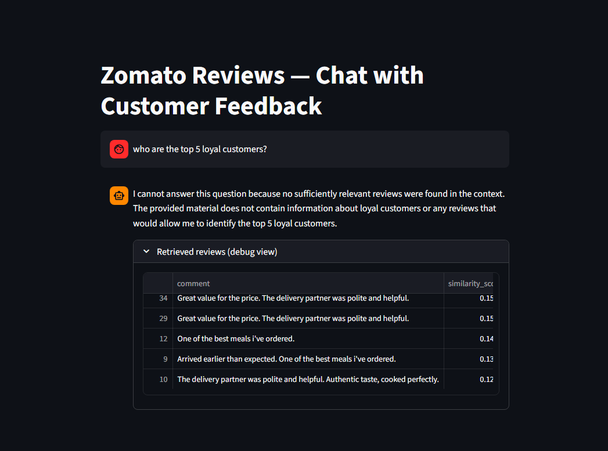

- Data folder in google drive: https://drive.google.com/drive/folders/1_dwsOGOMeiklN4Xi6_wAJoQ7-OuKLnQM?usp=drive_link
- to load the data into snowflake, use the code in scripts/

- naming convintions:
models: <folder abbreviation>__<model name >

## rag_chat_reviews:
- asking question outside of context

- context aware:

- recommendation and displaying the retrieved reviews:

## chat_with_data:
query, results, visualization:

- context aware: 
