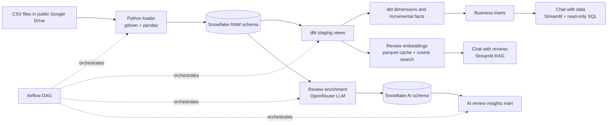

# Zomato Analytics: From Raw Data to Decision Support

An end-to-end analytics engineering learning project that turns food-delivery CSV files into trusted Snowflake models, operational metrics, and AI-assisted ways to explore orders and customer feedback.

> **Project status:** This is a portfolio and learning project built to demonstrate ownership of an end-to-end data product. The source data and AI outputs are not presented as production-measured business results.

## Table of Contents

- [Business problem](#business-problem)
- [What I built](#what-i-built)
- [Impact and results](#impact-and-results)
- [Architecture](#architecture)
- [Data model](#data-model)
- [AI capabilities](#ai-capabilities)
- [Project structure](#project-structure)
- [How to run](#how-to-run)
- [Limitations and next steps](#limitations-and-next-steps)

## Business Problem

Food-delivery businesses generate data across orders, customers, restaurants, menu items, delivery operations, and customer reviews. Without a shared analytical foundation, a CEO or COO may not have a consistent view of growth and operational performance, while marketing directors, finance teams, operations managers, and customer-experience leaders may each rely on different extracts or manually assembled reports. That makes it difficult to identify underperforming cities, understand cancellation and delivery issues, compare restaurant performance, or turn customer feedback into a prioritized action list.

This project addresses that problem by creating a single, repeatable path from raw source files to business-ready metrics and **searchable customer insight**. It is designed to support questions about revenue and order trends, city and restaurant performance, delivery service levels, customer behavior, and the themes and sentiment appearing in reviews.

## What I Built

- **End-to-end data platform**
	- Downloads seven CSV datasets from a public Google Drive folder using Python.
	- Loads the source data into Snowflake raw tables.
	- Transforms the raw data with dbt into staging views, conformed dimensions, incremental fact tables, and business-facing marts.
	- Applies dbt data tests to improve confidence in analytical outputs.
	- Uses Airflow to orchestrate ingestion, transformation, review enrichment, and AI-tagged dbt models as a repeatable workflow.
- **Natural-language data chat**
	- Converts plain-English questions into read-only Snowflake queries.
	- Returns query results as tables.
	- Selects a basic visualization when the result supports one.
	- Displays the generated SQL so users can inspect how the answer was produced.
- **AI-powered review analysis**
	- Enriches review comments with sentiment, sentiment score, topic, and key issue.
	- Stores the enrichment results in Snowflake for downstream modeling.
	- Embeds sampled review comments and retrieves semantically similar reviews.
	- Uses retrieved review excerpts as context for grounded answers in the review chat.
- **Containerized applications**
	- Packages the pipeline and its dependencies with Docker and Docker Compose.
	- Provides two Streamlit applications: one for structured data questions and one for customer-review exploration.

### Technology

- **Orchestration:** Apache Airflow with CeleryExecutor, Redis, and PostgreSQL
- **Runtime:** Docker and Docker Compose
- **Warehouse:** Snowflake
- **Transformation:** dbt Core with `dbt-snowflake`, dbt tests, incremental models, and model tags
- **Ingestion:** Python, `gdown`, pandas, and `write_pandas`
- **AI applications:** Python, Streamlit, OpenAI-compatible clients, and OpenRouter-hosted models
- **Review retrieval:** Embeddings, parquet caching, cosine similarity, and top-k retrieval

## Impact and Results

Before this platform, the source files alone did not provide a shared set of tested metrics, a repeatable refresh process, or a practical way to explore customer feedback at scale. The platform would give business teams:

- **A consistent performance view:** Leaders can compare orders, delivered GMV, average order value, cancellation rate, and delivery performance using shared definitions instead of reconciling separate reports.
- **Faster operational diagnosis:** Operations managers can identify cities, hours, or restaurants with weak delivery performance and investigate whether the issue is volume, cancellations, ratings, or delivery time.
- **Better commercial decisions:** Restaurant and commercial teams can compare restaurant revenue, order volume, customer ratings, cuisine, and average delivery time when prioritizing support or partnership actions.
- **A structured voice of the customer:** Customer-experience and product teams can group review feedback by sentiment and topic, quantify flagged issues, and inspect the comments behind those summaries.
- **More accessible analysis:** A stakeholder who can describe a question in plain English can explore the modeled data through the chat interface and inspect both the returned results and generated SQL.
- **A foundation for governed reporting:** Analysts and data teams have documented grains, reusable marts, incremental models, and tests that can support dashboards and a future semantic layer.

Example questions the project can answer through the data chat include:

- Which cities generated the highest delivered GMV last month?
- How does cancellation rate vary by city and order date?
- Which restaurants have high order volume but low customer ratings?
- What is the P50 and P90 delivery time by city and order hour?
- Which cuisines generate the most orders or revenue?
- What is the average order value for delivered orders by city?
- Which restaurants have the highest average delivery time?

The review assistant can answer evidence-based questions such as:

- What are customers most often unhappy about?
- Which restaurants are associated with positive comments about food quality?
- What delivery problems appear in the retrieved reviews?

These are demonstrated capabilities rather than measured production outcomes. Because the source data is used as a learning and portfolio dataset, no commercial uplift, cost saving, accuracy percentage, or revenue impact is claimed. Actual impact would be measured by comparing decision speed, reporting effort, operational KPIs, and AI answer quality before and after adoption with real stakeholders and production data.

## Architecture



The scheduled Airflow DAG is `zomato_load_and_transform` and runs daily with catchup disabled. Its task order is:

1. `load_data_from_gdrive`: download the CSVs and load Snowflake raw tables.
2. `dbt_build`: build non-AI dbt models.
3. `enrich_reviews`: classify new reviews with the configured LLM.
4. `build_ai_dbt_models`: build dbt models tagged `ai`.


*Caption: A successful DAG run showing the ingestion, transformation, review enrichment, and AI model tasks completing in sequence.*

## Data Model

### Source and staging layer

The dbt source `raw` points to database `ZOMATO`, schema `RAW`, and declares these seven tables:

| Source table | Purpose |
| --- | --- |
| `RAW_RESTAURANTS` | Restaurant attributes, location, cuisine, and ratings |
| `RAW_USERS` | Customer profile attributes |
| `RAW_FOOD` | Food item master data |
| `RAW_MENU` | Restaurant menu relationships |
| `RAW_ORDERS` | Order-level transactions and delivery attributes |
| `RAW_ORDER_ITEMS` | Item-level order details |
| `RAW_REVIEWS` | Customer ratings, comments, and review dates |

Staging models are views named `stg__users`, `stg__reviews`, `stg__restaurants`, `stg__food`, `stg__menu`, `stg__orders`, and `stg__order_items`. The project naming convention is `<layer abbreviation>__<model name>` for staging models.

### Dimensional and fact layer

| Model | Type | Grain or purpose |
| --- | --- | --- |
| `dim_customer` | Dimension | One row per customer; adds age segments |
| `dim_food` | Dimension | One row per food item |
| `dim_restaurants` | Dimension | One row per restaurant |
| `fct_orders` | Incremental fact | One row per order, keyed by `order_id` |
| `fact_order_items` | Incremental fact | One row per order item, keyed by `order_item_id` |

Both fact models use incremental merge materialization. Orders are filtered by the latest `order_timestamp`; order items use the related order timestamp.

### Business marts

| Mart | Grain | Main decision it supports |
| --- | --- | --- |
| `mart_daily_city_revenune` | One row per order date and city | Compare delivered GMV, AOV, orders, and cancellation rate |
| `mart_delivery_sla` | One row per city and order hour | Monitor delivered-order volume and P50/P90 delivery time |
| `mart_restaurant_performance` | One row per restaurant | Compare orders, revenue, ratings, and average delivery time |
| `mart_review_insights` | One row per topic and sentiment label | Summarize review volume, sentiment, ratings, and flagged issues |

The review-insights mart consumes `ZOMATO.AI.REVIEW_ENRICHED` and joins it to staged reviews. dbt tests currently cover uniqueness and non-null keys, customer relationships, and accepted order statuses.

## AI Capabilities

### Review enrichment

[`ai/reviews_enrichment.py`](ai/reviews_enrichment.py) reads reviews that are not already present in `ZOMATO.AI.REVIEW_ENRICHED`, sends each comment to an OpenAI-compatible endpoint through OpenRouter, and writes structured results to Snowflake. The classifier returns:

- `sentiment_label`: positive, negative, or neutral
- `sentiment_score`: a value from `-1.0` to `1.0`
- `topic`: food quality, delivery, pricing, service, packaging, or other
- `key_issue`: a short issue phrase, or null
- model and enrichment timestamp metadata

The current demonstration processes up to five new reviews per run (`SAMPLE_N = 5`). This is a deliberately small default for testing and keeping API costs low; users can increase or reduce it through the global variable in the module.

### Chat with data

[`ai/chat_with_data.py`](ai/chat_with_data.py) provides a Streamlit chat interface. The model receives a controlled schema description, generates one SQL statement, and the application permits only `SELECT` or `WITH` queries before execution. Results are displayed as a table, with optional bar, line, or pie visualization, and the generated SQL is visible for inspection.


*Caption: The interface exposes the generated result and visualization so a user can inspect the answer rather than receiving an opaque response.*


*Caption: Conversation history is passed back to the assistant so follow-up questions can use the current analytical context.*

### Chat with reviews

[`ai/rag_chat.py`](ai/rag_chat.py) samples reviews from Snowflake, embeds them with an embedding model, caches embeddings in `review_embeddings.parquet`, and retrieves the top five reviews by cosine similarity. A similarity threshold is applied before retrieved excerpts are sent to the chat model. The application displays the retrieved reviews in a debug view to make the answer traceable.


*Caption: The assistant is instructed to acknowledge when the retrieved reviews do not contain enough evidence instead of guessing.*


*Caption: The answer is grounded in semantically retrieved customer comments.*


*Caption: A recommendation-style question includes the retrieved restaurant and review context behind the response.*

## Project Structure

```text
.
├── ai/                         # Streamlit apps and review enrichment modules
├── assets/                     # Screenshots of the AI interfaces and DAG runs
├── dags/                       # Airflow DAG definitions
├── Scripts/                    # Google Drive to Snowflake ingestion script
├── zomato/
│   ├── models/staging/         # Source-backed cleanup and staging views
│   ├── models/marts/
│   │   ├── dimensions/         # Customer, food, and restaurant dimensions
│   │   ├── facts/              # Incremental order and order-item facts
│   │   └── marts/              # Business-facing aggregate marts
│   ├── macros/                 # Project-level dbt macros
│   ├── packages.yml            # dbt package dependencies
│   ├── profiles.yml            # Snowflake profile using environment variables
│   └── tests/                  # Custom dbt tests, if present
├── docker-compose.yml          # Local Airflow, Redis, and PostgreSQL services
├── Dockerfile                  # Airflow image with dbt and Python dependencies
└── .env                        # Local credentials and runtime configuration
```

## How to Run

### Prerequisites

- Docker Desktop with at least 4 GB of memory allocated; the Compose file recommends at least 2 CPUs and 10 GB of free disk space.
- A Snowflake account with permission to create or write to the configured database and schemas.
- Access to the [public Google Drive data folder](https://drive.google.com/drive/folders/1_dwsOGOMeiklN4Xi6_wAJoQ7-OuKLnQM?usp=drive_link).
- An OpenRouter API key for the AI modules.
- A local `.env` file. Do not commit it.

### Environment variables

```dotenv
SNOWFLAKE_USER=your_user
SNOWFLAKE_PASSWORD=your_password
SNOWFLAKE_ACCOUNT=your_account
SNOWFLAKE_WAREHOUSE=your_warehouse
SNOWFLAKE_DATABASE=ZOMATO
SNOWFLAKE_SCHEMA=RAW
api_key=your_openrouter_chat_key
embedding_api_key=your_openrouter_embedding_key
_AIRFLOW_WWW_USER_USERNAME=airflow
_AIRFLOW_WWW_USER_PASSWORD=airflow
```

The dbt profile reads the Snowflake variables from the environment. The Python modules use the lowercase `api_key` and `embedding_api_key` names shown above.

### Run the pipeline with Airflow

From the repository root:

```powershell
docker compose build
docker compose up airflow-init
docker compose up -d
```

Open [http://localhost:8080](http://localhost:8080), sign in with the Airflow credentials configured in `.env`, enable `zomato_load_and_transform`, and trigger it. The DAG is scheduled daily with one retry and a five-minute retry delay.

Useful commands:

```powershell
docker compose ps
docker compose logs -f airflow-scheduler
docker compose down
```

### Run ingestion and dbt manually

To run the stages without waiting for Airflow, use the project container or an environment with the same dependencies:

```powershell
python Scripts/load_data_from_gdrive_to_snowflake.py

Set-Location zomato
dbt deps
dbt build --exclude tag:ai --profiles-dir . --project-dir .
Set-Location ..

python ai/reviews_enrichment.py

Set-Location zomato
dbt build --select tag:ai --profiles-dir . --project-dir .
Set-Location ..
```

The Docker image installs `dbt-snowflake==1.8.0`, `openai`, `pandas`, `gdown`, `python-dotenv`, and `snowflake-connector-python` on top of Airflow `3.1.6`.

### Run the Streamlit applications

With Snowflake credentials and the AI keys available:

```powershell
streamlit run ai/chat_with_data.py
streamlit run ai/rag_chat.py
```

The applications expect the dbt marts and staged review data to exist in Snowflake. The review chat also creates a local `review_embeddings.parquet` cache as it embeds new sampled reviews.

## Limitations and Next Steps

Current limitations are intentional and visible in the code:

- The loader is a simple full-file loop using `write_pandas`; it has no schema contract, file manifest, quarantine path, or automated freshness checks.
- Review enrichment currently processes only five new reviews per invocation (`SAMPLE_N = 5`), and review chat samples fifty reviews (`NEW_REVIEWS = 50`). These small defaults are intended for testing and low-budget experimentation, not as hard processing limits; both values are global variables that users can change according to their data volume, evaluation needs, and available API budget.
- Review enrichment does not yet record failed reviews in a retry table, while review chat uses a local parquet cache and is not yet a scalable vector database implementation.
- The SQL safety check is a lightweight keyword filter; a production version should use a SQL parser, least-privilege Snowflake role, query timeout, and stronger statement validation.
- AI output quality, latency, token cost, and retrieval relevance have not yet been evaluated with a labeled test set.
- The Compose configuration is for local development and should not be treated as a production deployment.

Recommended next steps:

1. Build a governed semantic layer with documented metric definitions for GMV, AOV, cancellation rate, SLA, and restaurant performance.
2. Add source freshness, row-count, accepted-value, relationship, and anomaly tests, then publish dbt documentation and lineage artifacts.
3. Add a dashboard for city revenue, delivery SLA, restaurant performance, and review trends.
4. Make ingestion incremental and idempotent with file manifests, load timestamps, schema validation, and rejected-record handling.
5. Replace sampled review retrieval with a managed vector store or Snowflake vector search, and add retrieval and answer-quality evaluation.
6. Add CI/CD, secrets management, observability, Airflow failure alerts, and separate development and production Snowflake roles.

## Links

- [Public Google Drive source folder](https://drive.google.com/drive/folders/1_dwsOGOMeiklN4Xi6_wAJoQ7-OuKLnQM?usp=drive_link)
- [Airflow DAG](dags/pipeline.py)
- [dbt project](zomato/dbt_project.yml)
- [Ingestion script](Scripts/load_data_from_gdrive_to_snowflake.py)